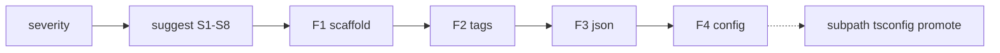

# Phase — Fix (apply suggestions)

**Status:** Deferred — after [`severity.md`](./severity.md) + [`suggest.md`](./suggest.md) ship stable findings, engine, and JSON.

**Companion:** [`suggest.md`](./suggest.md) · [`severity.md`](./severity.md) · [`commands.md`](./commands.md) · [`../systems/tiers.md`](../systems/tiers.md)

---

## Mission

Add **`expgov fix`** — the **only** write path for automated governance remediation.

| Command | Role | Writes? |
|---------|------|--------|
| `validate` / `diff` / `doctor` | Detect + severity + preview + tip | No |
| `suggest` | Full fix discovery (`-k`, `-d`, snippets) | **No — always read-only** |
| **`fix`** | Apply selected fix kinds from the suggest engine | **Yes** (with dry-run + confirm) |

**No `--apply` on `suggest`.** Users who want automation run `fix` subcommands after reviewing `suggest` output.

### Workflow

```txt
expgov validate
       ↓
expgov suggest              # see all fixes, copy snippets
       ↓
expgov fix tags -y          # safe: inject @sdkTier
expgov fix config --dry-run # preview config merge
       ↓
expgov validate
```

Validate tips stay: `run expgov suggest` — add `run expgov fix <subcommand>` only after `fix` subcommands ship.

---

## Architecture

```txt
governance/findings.ts       findings (severity phase)
governance/suggestions.ts    FixSuggestion[] (suggest phase)
governance/fix/              apply handlers per subcommand (this phase)

suggest  →  proposes FixSuggestion { kind, label, snippet, findingCode }
fix      →  executes FixSuggestion where an applier exists
```

Each subcommand maps to one or more `FixKind` values from [`suggest.md`](./suggest.md). Appliers consume the same engine output — no second suggestion heuristic.

**CLI host:** `packages/cli/bin/cli.ts` — `fix` as Commander subcommand group (like `init` patterns).

**Core entry:** `runExportsFix(subcommand, options)` in `packages/core/src/commands/fix.ts` (or `fix/index.ts`).

---

## Subcommands

| Subcommand | `FixKind`(s) | Risk | Status |
|------------|--------------|------|--------|
| **`tags`** | `tier-tag` | Low — additive JSDoc only | **v1 target** |
| **`config`** | `tier-exact`, `config-snippet` | Medium — edits `expgov.config.ts` | **v2** (after `tags` stable) |
| **`subpath`** | `subpath`, `demote-namespace` | High — barrel, `package.json` exports, tsconfig paths | **Postponed** |
| **`tsconfig`** | `tsconfig-sync` | Medium — root `tsconfig` paths | **Postponed** (after parity model stable) |
| **`promote`** | `promote-tier` | Medium — tier reclassification | **Postponed** (needs clear bucket policy UX) |

### v1 — `fix tags` (safe automation)

Inject configured tier tag (default `@sdkTier`) on declarations for symbols that `suggest` would fix with `kind: 'tier-tag'`.

**Example:**

```bash
expgov fix tags --dry-run
expgov fix tags -k tier-tag -d tier -y
```

**Writes:**

```ts
/** @sdkTier internal */
export function CLI_NAME() {}
```

**Why first:**

- Additive — does not remove exports or change runtime
- Easy revert (`git checkout`)
- Does not require barrel/subpath parser
- Aligns with tier classifier priority (tag can override config)

**Applier module (proposed):** `governance/fix/tags.ts` — locate symbol declaration via inventory source map / ts-morph or existing indexer (spike in `maintainer/temp/` before implementation).

### v2 — `fix config`

Merge `suggest` snippets into `expgov.config.ts`:

- Append to `tiers.<bucket>.exact`
- Add `tiers.policies.<name>` blocks for unknown policy refs

**Guards:**

- `--dry-run` shows unified diff
- `-y` required to write
- Preserve formatting where possible (jiti re-load + validate); avoid blind string splice if AST edit is feasible

**Depends on:** stable `formatTierExactSnippet` / config snippet shapes from suggest **S1**.

### Postponed — `fix subpath` (and hard surfaces)

**Do not schedule until:**

- [`severity.md`](./severity.md) + [`suggest.md`](./suggest.md) shipped and dogfooded
- Subpath export model documented in [`../systems/tiers.md`](../systems/tiers.md) + npm `exports` parity rules clear
- Dedicated **subpath engine** designed: barrel edits, re-exports, `package.json` `exports`, tsconfig `paths`, namespace moves

**Needs (future spike):**

- AST-level barrel transformer (not regex)
- Rollback story per symbol
- Interaction with `rootFlat` policy after move

Stay documented here as **placeholder** — no slice PR until upstream is stable and a clear plan exists in `maintainer/temp/` or a trimmed section added to this doc.

### Postponed — `fix tsconfig`, `fix promote`

| Subcommand | Blocked on |
|------------|------------|
| `tsconfig` | Severity parity findings + drift rules locked; same PR discipline as npm exports |
| `promote` | Tier bucket UX, policy overrides, and human review flow for tier promotion |

---

## Shared flags (`fix` parent + subcommands)

| Flag | Effect |
|------|--------|
| `--dry-run` | Print planned edits; no writes; exit `0` |
| `-y, --yes` | Skip confirm (non-interactive CI / scripts) |
| `-k, --kind <kinds>` | Limit to fix kinds (same vocabulary as `suggest`) |
| `-d, --domain <domains>` | Limit to finding domains |
| `-j, --json` | Machine envelope: `data.planned[]`, `data.applied[]`, `data.skipped[]` |
| `-n, --dry-run` | alias documented in help if `--dry-run` is canonical |

**Not inherited from triggers:** `-ns` (irrelevant on `fix`).

**Default:** interactive confirm per file or per batch unless `-y`.

---

## Slices (one PR each)

| # | Slice | Goal |
|---|-------|------|
| **F1** | `fix` command scaffold | CLI subcommand group, `runExportsFix`, help, dry-run plumbing |
| **F2** | `fix tags` applier | JSDoc tier-tag injection for unclassified / tag-suggested symbols |
| **F3** | `fix tags` JSON + tests | `--json`, fixture repos, idempotent re-run |
| **F4** | `fix config` applier | Merge `tier-exact` / policy snippets into `expgov.config.ts` |
| **F5** | `fix config` guards | dry-run diff, `-y`, validate-after tip |
| **F6** | Help workflow | `validate → suggest → fix` in help + `commandHelp.ts` |

**Phase v1 complete when:** F1–F3 shipped (`fix tags` production-usable).

**Phase v2 complete when:** F4–F6 shipped (`fix config`).

**Postponed (no slice until rescoped):** `fix subpath`, `fix tsconfig`, `fix promote` — see subcommand table above.

---

## F1 — Command scaffold

```txt
expgov fix [subcommand] [flags]

Subcommands (v1):
  tags     inject @sdkTier (or configured tag) on declarations
  config   merge tier allowlist / policy snippets into expgov.config.ts (F4+)

Postponed:
  subpath  move flat exports to published subpaths
  tsconfig sync tsconfig paths with npm exports
  promote  reclassify symbols to another tier bucket
```

**Exit:**

- [ ] `expgov fix` without subcommand prints help, exit `0`
- [ ] Unknown subcommand → usage error
- [ ] Core purity: appliers in `packages/core`, prompts only in CLI if needed

---

## F2 — `fix tags`

- Input: findings + suggestions filtered to `kind: 'tier-tag'`
- Resolve target tier from suggestion / classifier inference
- Insert JSDoc block immediately above declaration (function, const, type as applicable)
- Skip if tag already present and matches

**Exit:**

- [ ] Dogfood on `@expgov/core` dev scenarios (manual)
- [ ] `expgov validate` passes after tag fix for previously unclassified symbols
- [ ] No-op when nothing to apply

---

## F3 — `fix tags` JSON + tests

```json
{
  "ok": true,
  "kind": "fix",
  "data": {
    "subcommand": "tags",
    "dryRun": false,
    "applied": [{ "file": "packages/core/src/…", "symbol": "CLI_NAME", "tier": "internal" }],
    "skipped": []
  },
  "issues": [],
  "meta": { "command": "fix tags" }
}
```

**Exit:**

- [ ] Fixture-based tests for insert/skip/already-tagged
- [ ] Document in `docs/json.md`

---

## F4–F5 — `fix config`

- Parse or patch `expgov.config.ts` using snippets from `collectFixSuggestions`
- `--dry-run`: print diff to stdout
- Without `--dry-run`: require `-y` or interactive confirm
- Post-apply hint: `run expgov validate`

**Exit:**

- [ ] Idempotent: second run skips already-present exact entries
- [ ] Invalid config after edit caught by `parseExpgovConfig` ([`config.md`](./config.md) CF1) before write commit

---

## F6 — Help workflow

Root help **Workflows** appendix addition:

```txt
Fix tier drift          validate → suggest → fix tags → validate
Config allowlist        suggest -k tier-exact → fix config --dry-run → fix config -y
```

Update validate preview tip (severity V8) when F2 ships:

```txt
· run expgov suggest for full fixes · expgov fix tags to apply @sdkTier
```

---

## Machine-actionable JSON (upstream)

[`severity.md`](./severity.md) may add grouped violations for bots:

```json
"violationGroups": [
  {
    "type": "rootFlatViolation",
    "tier": "internal",
    "policy": "maintainer",
    "severity": "error",
    "symbols": ["CLI_NAME", "style"]
  }
]
```

`fix` subcommands consume `FixSuggestion[]` first; grouped violations are optional input for batch appliers later. Not required for F1–F3.

---

## Sequencing



**Schedule:** after **Suggest** phase complete — no rush. **Subpath / hard subcommands** stay postponed until dedicated engine + upstream docs exist.

---

## Non-goals

| Item | Why |
|------|-----|
| `--apply` on `suggest` | Suggest stays read-only — use `fix` |
| `fix subpath` in v1 | High risk; needs parser/engine spike |
| Auto-fix PR bot | After `fix tags` + `fix config` stable — [`active-phase.md`](./active-phase.md) |
| Changing tier classifier | [`../systems/tiers.md`](../systems/tiers.md) |
| Writing without `--dry-run` / confirm | Destructive edits forbidden by default |

---

## Files (expected touch)

| Area | Paths |
|------|-------|
| Command | `commands/fix.ts`, `commands/fix/tags.ts`, `commands/fix/config.ts` (later) |
| Appliers | `governance/fix/tags.ts`, `governance/fix/config.ts` (later) |
| CLI | `packages/cli/bin/cli.ts` (`fix` subcommand group) |
| Help | `help/index.ts`, `commandHelp.ts` |
| Docs | `docs/json.md`, `commands.md`, `systems/cli.md` |

---

## Receipt checklist (on ship)

- [ ] Row in [`../shipped/README.md`](../shipped/README.md) per subcommand milestone (tags v1, config v2).
- [ ] Durable notes in [`../systems/cli.md`](../systems/cli.md).
- [ ] Trim postponed sections or delete per [`README.md`](./README.md) lifecycle when fully shipped.
