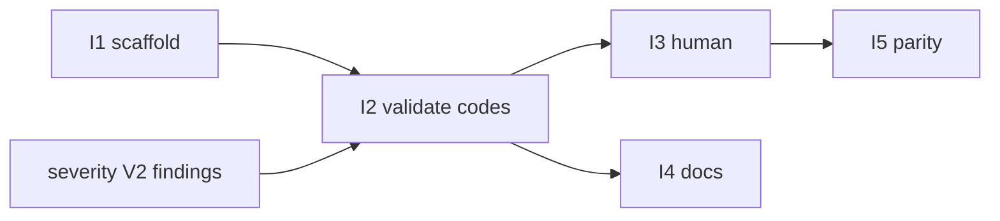

# Phase — Issues registry (`issues[]`)

**Status:** Planned — align with [`severity.md`](./severity.md) V2+ (structured findings → stable codes). Can start incrementally on `validate` / `doctor`.

**Reference implementation:** [i18nprune](https://github.com/) — `packages/core/src/shared/constants/issueCodes.ts`, `shared/result/issueDocLinks.ts`, `docs/issues/README.md`.

**Companion:** [`severity.md`](./severity.md) · [`suggest.md`](./suggest.md) · [`docs/cli/json.md`](../../docs/cli/json.md)

---

## Mission

Make **`issues[]`** a first-class, **extensible contract** across all core ops and CLI `--json` envelopes — same codes in human and machine output, with doc links like i18nprune.

Today expgov already has:

```ts
// types/json/envelope.ts
type Issue = { severity; code; message; path? };
// CliJsonEnvelope: { ok, kind, data, issues, meta }
```

Gaps:

- Codes are ad hoc strings (`expgov.validate.violation` for everything on validate).
- No `packages/core/src/issues/` module — codes not centralized.
- No `docHref` / topic pages under `docs/issues/`.
- Human output does not consistently print `issue: <code> · <url>` (i18nprune style).
- Not all commands populate `issues[]` in JSON (`diff` tier violations, etc.).

---

## Target architecture

```txt
packages/core/src/issues/
  codes.ts           ISSUE_* constants (expgov.validate.root_flat_denied, …)
  registry.ts        optional metadata: default severity, parent topic
  docLinks.ts        resolveIssueCodeDocLink, issueCodeDocHref, enrichIssuesWithDocHrefs
  builders/          optional: buildValidateIssues(findings) → Issue[]
    validate.ts
    config.ts
    doctor.ts

docs/issues/
  README.md          registry table + “adding codes” checklist
  validate.md        topic pages per namespace
  config.md
  doctor.md
  …
```

### Code naming

```txt
expgov.<namespace>.<tail>

expgov.validate.root_flat_denied
expgov.validate.unclassified
expgov.config.missing
expgov.config.invalid
expgov.suggest.unclassified
expgov.doctor.cache_not_gitignored
```

Stable **string values** — never rename after ship (pre-v1 still treat as contract).

### Envelope rule

Every `run*` command that can fail or warn returns:

```ts
{ payload, issues: Issue[] }  // core op
```

CLI `finishCommand` maps to `CliJsonEnvelope.issues`. **`ok`** derives from highest severity (errors fail; warnings per `--strict` — see severity phase).

### Human output (i18nprune parity)

After report body, emit enriched issues on warn/error channels:

```txt
[i18nprune] [warn] issue: expgov.validate.root_flat_denied · https://docs.expgov.dev/issues/validate#root-flat-denied
```

expgov equivalent (styling via existing `emitLog` / report layer — no `console.*` in core):

```txt
       issue: expgov.validate.root_flat_denied · <docHref>
```

**`enrichIssuesWithDocHrefs(issues)`** — CLI or `finishCommand` when not `--json`; JSON includes `docHref` when enriched (i18nprune attaches on envelope build).

### Doc links

Mirror i18nprune:

- `expgov.<parent>.<tail>` → `docs/issues/<parent>.md#<slug>`
- Slug: tail with `_` → `-` (VitePress-style)
- `DOCS_SITE_ORIGIN` + path when publishing; repo-relative `docPath` for offline

Until public docs site exists: `docPath: 'issues/validate'` in issues; full URL optional / placeholder in maintainer builds.

---

## Wiring checklist (per new code)

From i18nprune `docs/issues/README.md` — **one PR, three places:**

1. **`issues/codes.ts`** — `export const ISSUE_VALIDATE_ROOT_FLAT_DENIED = 'expgov.validate.root_flat_denied'`
2. **`docs/issues/<parent>.md`** — section `` ## `root_flat_denied` `` with Code / Severity / When / What to do
3. **`docs/issues/README.md`** — registry table row
4. Emit via builder from [`severity.md`](./severity.md) `GovernanceFinding.code` — same string as constant

---

## Slices (one PR each)

| # | Slice | Goal |
|---|-------|------|
| **I1** | `issues/` scaffold | `codes.ts`, `docLinks.ts`, tests for slug + href |
| **I2** | Validate codes | Split `expgov.validate.violation` into specific codes; builders |
| **I3** | Human issue lines | `enrichIssuesWithDocHrefs` + print on validate/doctor fail |
| **I4** | `docs/issues/*` v1 | README + validate + config + doctor topic pages |
| **I5** | JSON parity | `diff`, `suggest`, all commands emit `issues[]` when findings exist |
| **I6** | Core export | Export `issues` namespace from `@expgov/core` (tier TBD) |

**Phase v1 complete when:** I1–I4 shipped for validate + config load + doctor.

**Integrate with severity phase:** V2 findings carry `code` matching `ISSUE_*` constants; V4 validate uses `buildValidateIssues(findings)`.

---

## I1 — Scaffold

**Exit:**

- [ ] `resolveIssueCodeDocLink('expgov.validate.unclassified')` → `{ repoDocPath: 'issues/validate', anchor: 'unclassified' }`
- [ ] `enrichIssuesWithDocHrefs` idempotent
- [ ] No CLI dependency in `docLinks.ts`

---

## I2 — Validate codes (examples)

| Constant | Finding |
|----------|---------|
| `ISSUE_VALIDATE_ROOT_FLAT_DENIED` | `rootFlat: 'deny'` on barrel |
| `ISSUE_VALIDATE_UNCLASSIFIED` | missing tier |
| `ISSUE_VALIDATE_TSCONFIG_DRIFT` | paths ↔ npm |
| `ISSUE_VALIDATE_UNKNOWN_POLICY` | bad policy ref |

Replace generic `expgov.validate.violation` in `validate.ts`.

**Config codes (with [`config.md`](./config.md)):** `ISSUE_CONFIG_MISSING`, `ISSUE_CONFIG_INVALID`, `ISSUE_CONFIG_CONVERT_UNSUPPORTED`.

---

## I3 — Human lines

- Wire after `printValidateReport` or via shared `printIssuesFooter(issues)`.
- Respect `-q` / `-s` / `--json` (suppress human issue lines when JSON-only).
- Optional: OSC 8 hyperlinks (defer to CLI output audit phase F).

---

## I4 — Docs

- `docs/issues/README.md` — registry (public copy; maintainer seeds from phase).
- Per-code sections: **When**, **What to do**, link to `expgov suggest` / `expgov fix tags` where relevant.

---

## I5 — Command parity

| Command | `issues[]` today | Target |
|---------|------------------|--------|
| `validate` | generic violation code | I2 |
| `doctor` | `expgov.doctor.warning` | split codes |
| `suggest` | `expgov.suggest.unclassified` | keep + expand |
| `diff` | missing | tier + parity codes |
| `config show/export/convert` | — | `expgov.config.*` on parse/convert fail ([`config.md`](./config.md)) |

---

## Non-goals

- Rename shipped issue codes (semver major)
- Issues for successful informational-only runs (use `data.hints` or insights)
- Duplicate suggestion text inside `Issue.message` (keep message short; suggest engine owns fixes)

---

## Sequencing



**Schedule:** overlap **Severity V2–V4** — findings should emit registry codes from day one.

---

## Receipt checklist (on ship)

- [ ] Row in [`../shipped/README.md`](../shipped/README.md).
- [ ] [`docs/cli/json.md`](../../docs/cli/json.md) updated (`docHref`, code stability note).
- [ ] Agent rule: three-place wiring for new codes (mirror i18nprune `architecture.md`).
