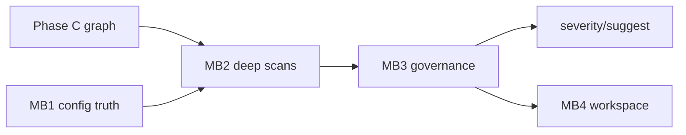

# Phase — Multi-entry API surface (multibarrel)

**Status:** Planned — after Phase **C** (graph 2.0) or in parallel with **MB1** dogfood on vercel/ai `packages/ai`.

**Companion:** [`../systems/config.md`](../systems/config.md) · [`sourceProfiles.md`](./sourceProfiles.md) · [`graph-2.md`](./graph-2.md) · [`severity.md`](./severity.md) · [`../shipped/examples-sdk.md`](../shipped/examples-sdk.md) (I2 monorepo)

---

## Mission

Evolve expgov from **single-root barrel analyzer** to **multi-entry API topology** under one npm package — mirroring `package.json` `exports` without merging barrels or losing boundaries.

```txt
not “multi-barrel” as a flat list
→ multi-entry API surface under one package contract

workspace (future MB4)
  └── package (packageName + core)
        ├── entry "."        → rootBarrel + subpaths['.']
        ├── entry "./internal"
        └── entry "./test"
```

**Separate concerns:**

| Concept | Phase / module | Role |
|---------|----------------|------|
| **Subpaths** | this phase | npm publish entries → source barrels |
| **Source profiles** | [`sourceProfiles.md`](./sourceProfiles.md) | `.ts` / `.mjs` parse semantics |
| **Workspace** | MB4 | many packages in one repo |

---

## Today (baseline)

| Capability | Status |
|------------|--------|
| `core.rootBarrel` | One repo path — **full** `enrichBarrel` (symbols, edges, graph) |
| `core.subpaths` | Map npm key → path **relative to `core.dir`** via `coreRepoPath()` |
| Subpath rollups | Tier flat **counts** per published entry (`buildSubpathRollups`) |
| SDK-wide tiers | Root + subpath rollups summed |
| `validate` | Root flat policy + per-subpath unclassified counts |
| `diff` / `timeline` | **Root barrel only** |
| `graph` | Edges from root scan; target subpath labels (Phase C) |

**Config resolution (critical):**

```ts
rootBarrel: 'packages/ai/src/index.ts'     // repo-relative
subpaths: {
  '.': 'src/index.ts',                     // → packages/ai/src/index.ts
  internal: 'internal/index.ts',            // → packages/ai/internal/index.ts
}
```

**Common misconfig:** subpath values as repo paths (`packages/ai/src/...`) — double-prefixes under `core.dir` and breaks rollups.

**Subpath tier hints (shipped):** `npmSubpath` ending in `/internal` → internal tier; `/advanced` → advanced.

---

## Design principles (agreed)

1. **Do not** merge barrels into one synthetic surface (Option 1 — rejected).
2. **Do not** use a flat `barrels: []` without npm entry keys (Option 2 — rejected).
3. **Do** model **root + published subpaths** aligned with `package.json` `exports` (Option 3 — current + extended).
4. **Do not** mix source profiles into subpath config.
5. **Workspace / multi-package** is a **separate** layer (MB4), not a bigger `subpaths` map.

---

## Target end state (highest level)

```txt
expgov inventory --entry internal
expgov validate        → findings tagged entry: ai/internal
expgov diff            → per-entry breakdown optional
expgov graph --entry . → full edges for that entry’s barrel
expgov suggest -d subpath
```

Each **entry** can have full snapshot depth (symbols, edges), entry-scoped policy, and cache — under one `packageName`.

---

## Slices (one PR each)

| # | Slice | Goal |
|---|-------|------|
| **MB1** | Config truth + doctor | Resolution docs, path validation, exports↔subpaths sync hints |
| **MB2** | Deep entry scans | Full `enrichBarrel` per subpath; snapshot schema + cache |
| **MB3** | Per-entry governance | Policy/tier by entry; validate/diff/suggest/severity by entry |
| **MB4** | Workspace mode | Multiple packages (`projects[]` or workspace config) |

**Phase complete (v1 multibarrel):** MB1–MB3 for single package. **MB4** = monorepo governance (vercel/ai full repo).

---

## MB1 — Config truth + doctor

**No schema break** — fix footguns and observability.

| Task | Detail |
|------|--------|
| Document resolution | `rootBarrel` repo-relative; `subpaths` relative to `core.dir` — [`systems/config.md`](../systems/config.md) |
| `doctor` / `config show` | Each subpath → resolved repo path, exists?, flat count |
| Mismatch detection | `rootBarrel` 0 flats but subpath `.` has many → warn |
| `exports` cross-check | Compare `packages/*/package.json` `exports` keys to `subpaths` keys (doctor hint) |
| `init` improvement | Map `exports` → subpath entries (extend `firstExportSubpath` for `./internal`, etc.) |
| Tag pattern note | Per-package tags (e.g. `ai@*`) — document in config comments |

**Dogfood:** vercel/ai `packages/ai` — [`examples-sdk.md`](../shipped/examples-sdk.md) I2.

**Exit:**

- [ ] `expgov doctor` on ai repo lists three entries with resolved paths.
- [ ] Misconfigured double-prefix subpaths caught with clear message.
- [x] `expgov inventory` non-zero on `packages/ai` — dogfood `~/ai/expgov.config.ts` (root 25 flat; `ai/internal` 28; `ai/test` 21).

**Dogfood verified:** misconfigured subpaths as repo paths → empty rollups; fixed config resolves correctly (see reference block below).

---

## MB2 — Deep entry scans

**Today:** only `rootBarrel` populates `snapshot.symbols` / `edges`.

**Target:** each configured subpath (except duplicate of root file) gets `enrichBarrel` → stored as nested entry snapshots.

```ts
type InventorySnapshot = {
  // ... existing ...
  entries?: Record<string, EntrySnapshot>; // key: subpath ('.', 'internal', 'test')
};
```

| Task | Detail |
|------|--------|
| `buildEntrySnapshots(reader)` | Loop `publishedSubpathBarrels()`, skip if same repoPath as root |
| Cache | Extend `inventory.full.json` schema version; rebuild invalidates stale |
| `inventory` / `graph` | `--entry <key>` filter (default: root + summary of all entries) |
| `diff` | Optional per-entry flat delta in report (root unchanged default) |
| Timeline | **Stay root-only** for MB2 — one `timelineBarrelPath`; per-entry timeline deferred |

**Exit:**

- [ ] `expgov graph --entry internal` shows edges for `internal/index.ts`.
- [ ] Cache round-trip tests with multi-entry snapshot.
- [ ] JSON `data.entries` documented in `docs/cli/json.md`.

---

## MB3 — Per-entry governance

| Task | Detail |
|------|--------|
| `rootFlat` scope | **Entry `.` only** for deny policy on flat exports; subpaths use entry tier hints + normal rules |
| Config (optional) | `core.entries.<key>.tierHint` override |
| Findings | `GovernanceFinding.entry` + `expgov.validate.*` codes per entry ([`issues.md`](./issues.md)) |
| `validate` | Group violations by entry; preview via suggest engine |
| `suggest` | `-d subpath` maps to entry; subpath-specific fixes |
| `severity` | Policy context includes entry name |

**Exit:**

- [ ] `ai/internal` exports classified internal without failing root stable rules.
- [ ] `validate` reports `ai` vs `ai/internal` separately.

---

## MB4 — Workspace mode (monorepo)

**Scope:** vercel/ai-scale — 80+ packages. **Deferred** until MB1–MB3 stable on single package.

```ts
// sketch — not implemented
workspace: {
  packages: [
    { packageName: 'ai', core: { dir: 'packages/ai', ... } },
    { packageName: '@ai-sdk/openai', core: { dir: 'packages/openai', ... } },
  ],
}
```

Or: `expgov.config.ts` + `expgov.workspace.ts` + `expgov --package ai` selector.

| Task | Detail |
|------|--------|
| CLI `--package` / `-p` | Select workspace member |
| Shared cache layout | `.expgov/cache/<package>/<sha>/` |
| Validate workspace | Run per package or `--all` summary |
| tsconfig parity | Per-package tsconfig where paths exist |

**Non-goal MB4 v1:** one merged inventory across all packages.

---

## vercel/ai reference config

Dogfood file: `~/ai/expgov.config.ts` (maintainer machine) — pattern:

```ts
packageName: 'ai',
core: {
  dir: 'packages/ai',
  rootBarrel: 'packages/ai/src/index.ts',
  subpaths: {
    '.': 'src/index.ts',
    internal: 'internal/index.ts',
    test: 'test/index.ts',
  },
},
git: { tagPattern: 'ai@*', timelineBarrelPath: 'packages/ai/src/index.ts' },
```

Matches `packages/ai/package.json` `exports` source layout.

---

## Sequencing



**Schedule:** MB1 anytime (docs + doctor); MB2 after graph/cache schema agreement; MB3 with [`severity.md`](./severity.md); MB4 with examples I2 monorepo.

---

## Non-goals

| Item | Why |
|------|-----|
| Merge all barrels into one | Loses npm boundaries |
| `barrels: string[]` without export keys | No governance mapping |
| Per-entry timeline in MB2 | Complexity; root barrel enough for git log initially |
| Auto-migrate barrel files | [`fix.md`](./fix.md) `subpath` postponed |
| Replace `package.json` exports | expgov reads exports; does not write them (except future fix) |

---

## Files (expected touch)

| Area | Paths |
|------|--------|
| Inventory | `inventory/build.ts`, `inventory/source.ts` |
| Snapshot types | `types/inventory/*` |
| Cache | `cache/store/*`, schema version bump |
| Commands | `inventory`, `graph`, `validate`, `diff` |
| Doctor | `commands/doctor.ts` |
| Init | `init/detect.ts` |
| Docs | `systems/config.md`, `docs/config.md` |

---

## Receipt checklist (on ship)

- [ ] Row in [`../shipped/README.md`](../shipped/README.md) per MB milestone.
- [ ] vercel/ai `packages/ai` dogfood note in [`examples-sdk.md`](../shipped/examples-sdk.md).
- [ ] Trim per [`README.md`](./README.md) lifecycle when MB1–MB3 done.
