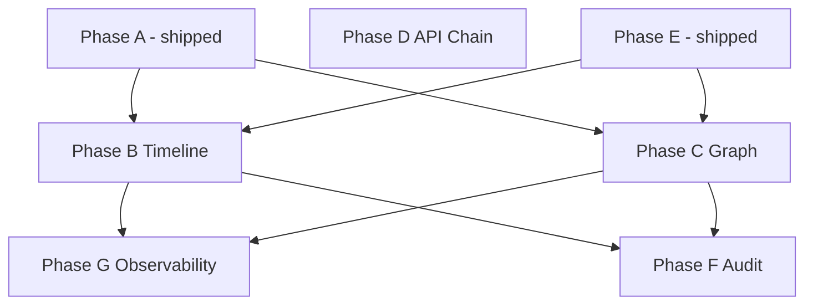

# Observability & CLI DX Roadmap

**Status:** Phases **A**, **E**, and **B1–B3** shipped. Active work: **B4** (timeline summaries) + **C** (graph 2.0).

**Shipped detail:** [`shipped/runtime-cli.md`](../shipped/runtime-cli.md) · [`shipped/git-commands.md`](../shipped/git-commands.md) · [`shipped/examples-sdk.md`](../shipped/examples-sdk.md).

---

## Mission

Polished SDK observability CLI — core purity, TypeScript-only config, inventory/cache as source of truth, incremental PRs.

---

## Open work

| Phase | Status | Document |
|-------|--------|----------|
| **B4–B5** | B4 next | [`timeline-2.md`](./timeline-2.md) |
| **C** | Planned | [`graph-2.md`](./graph-2.md) |
| **D** | Planned | [`../api-chain.md`](../api-chain.md) |
| **F** | Planned | [`cli-output-audit.md`](./cli-output-audit.md) |
| **G** | Planned | [`../systems/observability.md`](../systems/observability.md) |
| **H** | Deferred | [`sourceProfiles.md`](./sourceProfiles.md) |

**Shipped (receipts):** A · E · P16 · I1/I3 · B1–B3 — [`shipped/README.md`](../shipped/README.md).

---

## Command surface (today)

| Command | Cache profile | Listing | Insights | Notes |
|---------|---------------|---------|----------|-------|
| `inventory` | full | `-T`/`-F` | yes | |
| `diff` | full ×2 | yes | yes | |
| `validate` | worktree | yes | yes | |
| `trend` | full per tag | yes | yes | |
| `graph` | full | yes | yes | |
| `timeline` | timeline | yes | yes | ref ranges, release markers, `rows[].step` |
| `init` | — | — | tips | |

Global: `-C`, `-c`, `-pn`, `-cd`, `-j`, `-q`, `-s`, `-nlc`, `-nlg`, `-ncl`. Bare `expgov` → help, exit 0.

Cache: `.expgov/cache/<sha>/` + `__worktree__/` (`files.json`, `inputFilesEpoch`).

---

## Dependency graph

---

## Sequencing

1. Finish **B4** (timeline summaries) — [`active-phase.md`](./active-phase.md)
2. **Phase C** — graph 2.0
3. **D** → **F** → **G** per [`active-phase.md`](./active-phase.md) backlog
