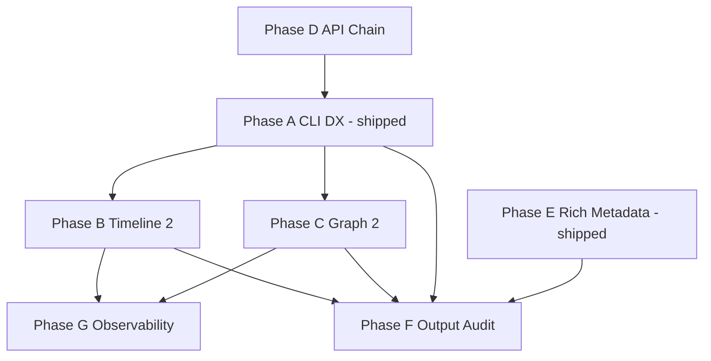

# Observability & CLI DX Roadmap

**Status:** Phases **A** and **E** shipped — active work **B** (timeline 2.0) and **C** (graph 2.0).

**Audience:** Maintainers sequencing the next evolution of expgov.

**Shipped detail:** Phase A → [`shipped/runtime-cli.md`](../shipped/runtime-cli.md) (P6, P9–P15). Phase E → same (P17). Phase I → [`shipped/examples-sdk.md`](../shipped/examples-sdk.md).

---

## Mission shift

Evolve expgov from **export-governance CLI** to **polished SDK observability tool** while preserving:

- Core purity (`packages/core` — no TTY/chalk in engine paths)
- TypeScript-only config
- Inventory/cache as single source of truth
- Incremental PRs, backwards-compatible argv where reasonable

---

## Planning documents (open work only)

| Phase | Status | Document / map |
|-------|--------|----------------|
| **B** | Planned | [`timeline-2.md`](./timeline-2.md) |
| **C** | Planned | [`graph-2.md`](./graph-2.md) |
| **D** | Planned | [`../api-chain.md`](../api-chain.md) |
| **F** | Planned | [`cli-output-audit.md`](./cli-output-audit.md) |
| **G** | Planned | [`../systems/observability.md`](../systems/observability.md) |
| **H** | Deferred | [`sourceProfiles.md`](./sourceProfiles.md) |

**Shipped (receipts, not phase plans):** A · E · P16 worktree gate · I1/I3 — [`shipped/README.md`](../shipped/README.md).

---

## Current state summary

### Commands

| Command | Cache | Listing (`-T`/`-F`) | Insights (P17) |
|---------|-------|---------------------|----------------|
| `inventory` | full | yes | shipped |
| `diff` | full ×2 | yes | shipped |
| `validate` | worktree bypass | yes | shipped |
| `trend` | per tag | yes | shipped |
| `graph` | full | yes | shipped |
| `timeline` | timeline profile | yes | shipped |
| `init` | — | — | tips only |

### Global flags

`-C`, `-c/--config`, `-pn/--package-name`, `-cd/--cache-dir`, `-y`, `-j`, `-q`, `-s`, `-nlc`, `-nlg`, `-ncl/--no-color`. Bare `expgov` → help, exit 0.

### Cache

`.expgov/cache/<sha>/` + `__worktree__/` with `files.json` + `inputFilesEpoch` (P16).

### Still open (B/C/D)

- Timeline: time ranges only — not `v1..v2` git ref ranges; no release markers (B).
- Graph: subpath groups + top modules — not namespace-first analytics (C).
- API chain trace: not wired to CLI (D).

---

## Cross-phase dependency graph

---

## Recommended program order

### Done

- Phase **A** (listing, aliases, color, provenance, help, truncation)
- Worktree **files.json** gate (P16)
- Phase **E** — command insights on all governance commands (P17)
- Phase **I** partial — SDK example + CI smoke (I1, I3)

### Next

1. Phase **B1** timeline ref ranges + **B2** release markers
2. Phase **C2** graph analytics + **C1** namespace-centric report
3. Phase **B3–B4** timeline metadata + summaries
4. Phase **F** glossary + indent constants (from audit)
5. Phase **D** trace bus
6. Phase **G** metrics one family per PR

---

## Principles

- Stay incremental — no unnecessary rewrites
- Preserve backwards compatibility (`--limit` shim, additive JSON)
- Reuse inventory/cache — no duplicate parsers
- Maximize shared helpers (`listing`, `insights`, `graph/analytics`, `trace`)
- CLI output: information-dense, never noisy

---

## Entry criteria (Wave 1)

**Complete:**

- [x] Nested tier schema shipped (dogfood config)
- [x] `expgov validate` CI gate
- [x] User `docs/` stubs for flag contracts

**Current focus:** Phase **B** / **C**.

---

## Exit criteria (program complete)

- All list commands support `--top` / `--full` with identical UX — **done**
- `timeline` accepts git ref ranges and shows release markers
- `graph` is namespace-first with documented analytics
- `-v` shows execution chain (or `-vv` for detail)
- Each command answers ≥1 “next question” inline — **done** (P17)
- Phase F audit items owned or explicitly deferred with reason
- Phase G metric catalog defined in [`systems/observability.md`](../systems/observability.md) — all G slices **planned**

---

## Related maintainer docs

- [`commands.md`](./commands.md) — command contracts + deferred verbs
- [`../systems/principles.md`](../systems/principles.md) — constraints and deferred scope
- [`../shipped/README.md`](../shipped/README.md) — closed work receipts
- [`systems/README.md`](../systems/README.md) — engineering maps
