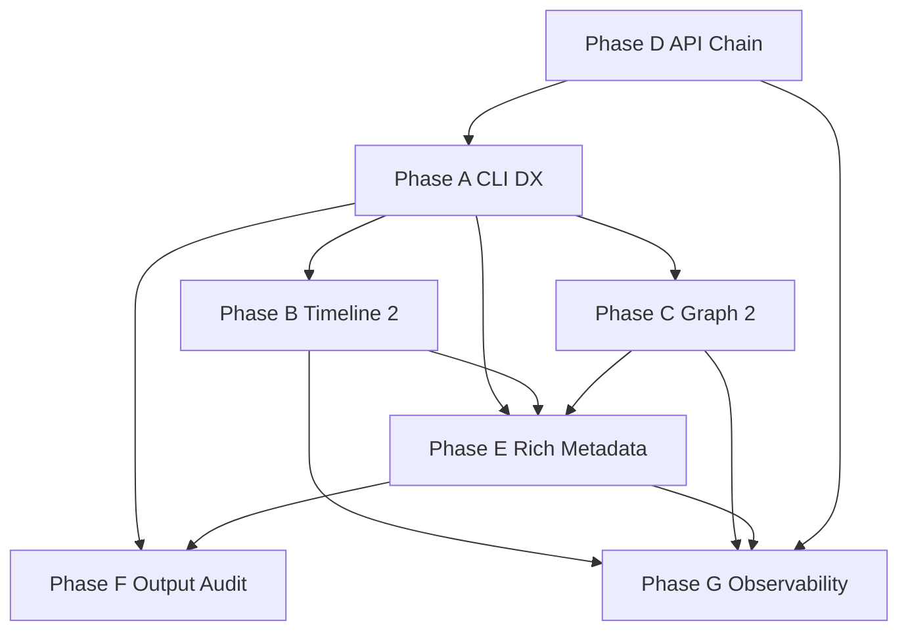

# Observability & CLI DX Roadmap

**Status:** Planning only — execute after current governance sprint (tiers polish, CI validate, user docs).

**Audience:** Maintainers sequencing the next evolution of expgov.

---

## Mission shift

Evolve expgov from **export-governance CLI** to **polished SDK observability tool** while preserving:

- Core purity (`packages/core` — no TTY/chalk in engine paths)
- TypeScript-only config
- Inventory/cache as single source of truth
- Incremental PRs, backwards-compatible argv where reasonable

---

## Planning documents

| Phase | Document | Focus |
|-------|----------|-------|
| **A** | [`cli-dx-polish.md`](./cli-dx-polish.md) | Listing `--top`/`--full`, aliases, color, provenance, help |
| **B** | [`timeline-2.md`](./timeline-2.md) | Git ref ranges, release markers, rich deltas, summaries |
| **C** | [`graph-2.md`](./graph-2.md) | Namespace-root graph, analytics, filters |
| **D** | [`../api-chain.md`](../api-chain.md) | Execution introspection pipeline |
| **E** | [`rich-command-metadata.md`](./rich-command-metadata.md) | Answer the next question per command |
| **F** | [`cli-output-audit.md`](./cli-output-audit.md) | Full UX audit receipt |
| **G** | [`observability.md`](./observability.md) | Long-term metrics from cache/snapshots |

---

## Current state summary (audit baseline)

### Commands (wired, stable)

| Command | Core entry | Cache | Key output limits today |
|---------|------------|-------|-------------------------|
| `init` | CLI `ensureConfig` | — | — |
| `inventory` | `runExportsInventory` | full | top 4 categories |
| `diff` | `runExportsDiff` | full ×2 | unbounded added/removed |
| `validate` | `runExportsValidate` | worktree bypass | 5 notes |
| `trend` | `runExportsTrend` | per tag | `--tags` window |
| `timeline` | `runExportsTimeline` | timeline profile | `--limit` 20 |
| `graph` | `runExportsGraph` | full | 12/15/8 slices |
| `help` | `printHelp` | — | — |

### Global flags (today)

`-C`, `--config`, `--package-name`, `--cache-dir`, `-y`, `-j`, `-q`, `-s`, `--color` (default true), `--no-color`

`RunOptions.noLogPrefix` / `noLogChannel` exist in core but are **not CLI-wired**.

### Cache model

`.exports/cache/<sha>/inventory.full.json` + `timeline.summary.json`; statuses `hit|miss|refresh|bypass`.

### Timeline model

Time ranges only (`@4w`, ISO week, date range) — **not** `v1..v2` git ref ranges.

### Graph model

Target subpath groups + alphabetical namespaces + top modules by edge count — **not** namespace-first analytics.

### Logging

`emitLog` events: report, meta, header, summary, note, footer. `TimelineWarmer` bypasses emitter (purity debt).

### Provenance gap

`tierSource: tag | fallback` — verbose shows `[fallback]` without config rule path.

---

## Cross-phase dependency graph

---

## Recommended program order

### Wave 1 — Foundation (2–3 PRs)

1. Phase **A3** color + **A2** aliases (incl. `noLogPrefix`/`noLogChannel`)
2. Phase **A1** shared listing helper + command adoption
3. Phase **D1** trace bus + `TimelineWarmer` emitter migration

### Wave 2 — Surface quality (3–4 PRs)

4. Phase **A4** tier provenance + **A5** help workflows
5. Phase **E** insights module + inventory/validate/diff/trend
6. Phase **F** glossary + indent constants (from audit)

### Wave 3 — Structural observability (3–4 PRs)

7. Phase **B1** timeline ref ranges + **B2** release markers
8. Phase **C2** graph analytics + **C1** namespace-centric report
9. Phase **B3–B4** timeline metadata + summaries (merge with E timeline insights)

### Wave 4 — Depth (ongoing)

10. Phase **C3** graph filters + **C4** modes as flags
11. Phase **D2–D4** cache/git/classify tracing
12. Phase **G** metrics one family per PR (churn → velocity → health → report)

---

## Principles (from planning brief)

- Stay incremental — no unnecessary rewrites
- Preserve backwards compatibility (`--limit` shim, additive JSON)
- Reuse inventory/cache — no duplicate parsers
- Maximize shared helpers (`listing`, `insights`, `graph/analytics`, `trace`)
- CLI output: information-dense, never noisy
- Every proposal documents: motivation, user value, approach, dependencies, complexity, risks, extensions

---

## Entry criteria (when to start Wave 1)

From [`active-phase.md`](./active-phase.md) — **complete**:

- [x] Nested tier schema shipped (dogfood config)
- [x] `expgov validate` CI gate
- [x] User `docs/` stubs for flag contracts

**Wave 2** (Phases A–G) — row **#1** (`suggest`) shipped; start Phase **A**.

---

## Exit criteria (program complete)

- All list commands support `--top` / `--full` with identical UX
- `timeline` accepts git ref ranges and shows release markers
- `graph` is namespace-first with documented analytics
- `-v` shows execution chain (or `-vv` for detail)
- Each command answers ≥1 “next question” inline
- Phase F audit items owned or explicitly deferred with reason
- Phase G1–G3 shipped; G4–G8 scheduled or deferred in observability.md

---

## Related maintainer docs

- [`commands.md`](./commands.md) — command contracts + deferred verbs (`doctor`, `suggest`)
- [`architecture.md`](./architecture.md) — package map, principles
- [`shipped-slices.md`](./shipped-slices.md) — do not re-implement receipts
- [`../systems/README.md`](../systems/README.md) — engineering maps
