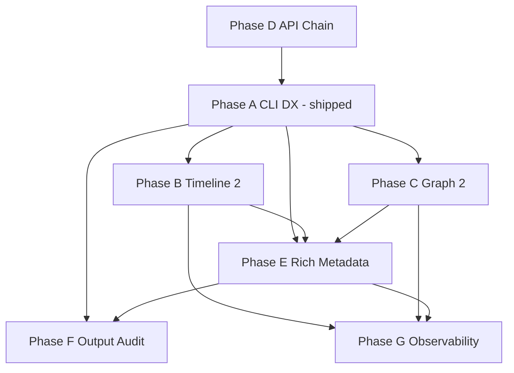

# Observability & CLI DX Roadmap

**Status:** Phase A + P16 + P17 (partial E) shipped — active work on Phase E remainder, then B/C.

**Audience:** Maintainers sequencing the next evolution of expgov.

---

## Mission shift

Evolve expgov from **export-governance CLI** to **polished SDK observability tool** while preserving:

- Core purity (`packages/core` — no TTY/chalk in engine paths)
- TypeScript-only config
- Inventory/cache as single source of truth
- Incremental PRs, backwards-compatible argv where reasonable

---

## Planning documents

| Phase | Status | Document / map |
|-------|--------|----------------|
| **A** | Shipped (P6, P9–P15) | [`systems/cli.md`](../systems/cli.md) |
| **B** | Planned | [`timeline-2.md`](./timeline-2.md) |
| **C** | Planned | [`graph-2.md`](./graph-2.md) |
| **D** | Planned | [`../api-chain.md`](../api-chain.md) |
| **E** | In progress (P17 partial) | [`rich-command-metadata.md`](./rich-command-metadata.md) |
| **F** | Planned | [`cli-output-audit.md`](./cli-output-audit.md) |
| **G** | Planned | [`systems/observability.md`](../systems/observability.md) |

Worktree cache gate (2e): shipped P16 — [`systems/cache.md`](../systems/cache.md).

---

## Current state summary

### Commands

| Command | Cache | Listing (`-T`/`-F`) | Insights (P17) |
|---------|-------|---------------------|----------------|
| `inventory` | full | yes | shipped |
| `diff` | full ×2 | yes | shipped |
| `validate` | worktree bypass | yes | shipped |
| `trend` | per tag | yes | shipped |
| `timeline` | timeline profile | yes | pending (Phase B) |
| `graph` | full | yes | pending (Phase C) |
| `init` | — | — | tips only |

### Global flags

`-C`, `-c/--config`, `-pn/--package-name`, `-cd/--cache-dir`, `-y`, `-j`, `-q`, `-s`, `-nlc`, `-nlg`, `-ncl/--no-color`. Bare `expgov` → help, exit 0.

### Cache

`.expgov/cache/<sha>/` + `__worktree__/` with `files.json` + `inputFilesEpoch` (P16).

### Still open (B/C/D)

- Timeline: time ranges only — not `v1..v2` git ref ranges; no release markers.
- Graph: subpath groups + top modules — not namespace-first analytics.
- API chain trace: not wired to CLI.

---

## Cross-phase dependency graph

---

## Recommended program order

### Done

- Phase **A** (listing, aliases, color, provenance, help, truncation)
- Worktree **files.json** gate (P16)
- Phase **E** partial — inventory, validate, diff, trend insights (P17)

### Next

1. Finish Phase **E** — graph + timeline insights (after / with B/C analytics)
2. Phase **B1** timeline ref ranges + **B2** release markers
3. Phase **C2** graph analytics + **C1** namespace-centric report
4. Phase **B3–B4** timeline metadata + summaries
5. Phase **F** glossary + indent constants (from audit)
6. Phase **D** trace bus + `TimelineWarmer` emitter migration
7. Phase **G** metrics one family per PR

---

## Principles

- Stay incremental — no unnecessary rewrites
- Preserve backwards compatibility (`--limit` shim, additive JSON)
- Reuse inventory/cache — no duplicate parsers
- Maximize shared helpers (`listing`, `insights`, `graph/analytics`, `trace`)
- CLI output: information-dense, never noisy

---

## Entry criteria (Wave 1)

From [`active-phase.md`](./active-phase.md) — **complete**:

- [x] Nested tier schema shipped (dogfood config)
- [x] `expgov validate` CI gate
- [x] User `docs/` stubs for flag contracts

**Current focus:** Phase **E** remainder → Phase **B** / **C**.

---

## Exit criteria (program complete)

- All list commands support `--top` / `--full` with identical UX — **done**
- `timeline` accepts git ref ranges and shows release markers
- `graph` is namespace-first with documented analytics
- `-v` shows execution chain (or `-vv` for detail)
- Each command answers ≥1 “next question” inline — **partial** (P17)
- Phase F audit items owned or explicitly deferred with reason
- Phase G1–G3 shipped; G4–G8 scheduled in [`systems/observability.md`](../systems/observability.md)

---

## Related maintainer docs

- [`commands.md`](./commands.md) — command contracts + deferred verbs
- [`../systems/principles.md`](../systems/principles.md) — constraints and deferred scope
- [`../shipped/README.md`](../shipped/README.md) — closed work receipts
- [`systems/README.md`](../systems/README.md) — engineering maps
