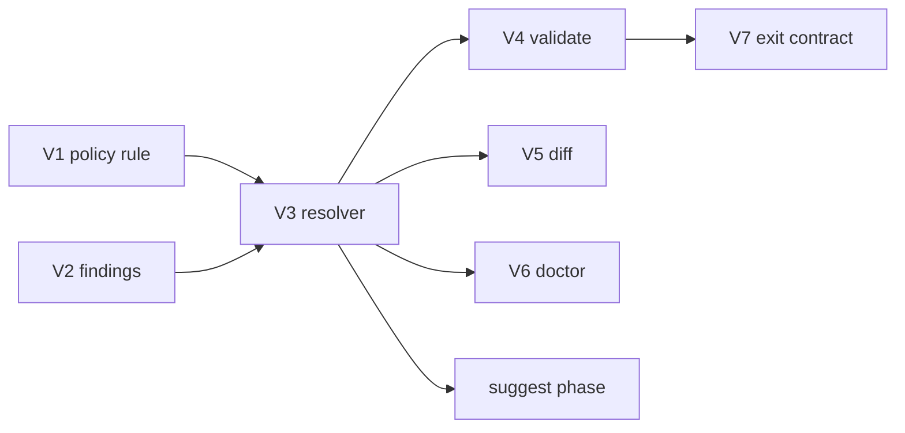

# Phase — Severity (tier policy engine)

**Status:** Planned — **implement ASAP** (next governance slice after active sprint allows).

**Companion:** [`../systems/tiers.md`](../systems/tiers.md) · [`suggest.md`](./suggest.md) (fix suggestions — separate phase) · [`commands.md`](./commands.md)

---

## Mission

Level up violation reporting from flat strings + exit `1` to **policy-aware severity** on every command that emits issues.

Today: every `validate` violation → `error`; severity is not driven by tier policy.

Target:

1. **Severity as a tier policy rule** — new composable field on `tiers.policies.*.rules` (alongside `rootFlat`).
2. **Shared findings** — one collector produces structured issues with stable codes + severity.
3. **All violation commands adopt severity** — `validate`, `diff`, `doctor`, and later others emit graded `issues[]`.
4. **Guide to `suggest`** — when issues are found, commands point the user at `expgov suggest` for fixes; **no inline suggestions** on validate/diff/doctor (that lives in [`suggest.md`](./suggest.md)).

```txt
validate / diff / doctor          suggest (standalone)
        │                                │
        ├─ detect issues                 ├─ detect same issues
        ├─ severity from policy          ├─ suggest fixes for each
        └─ hint: "run expgov suggest"    └─ snippets, kinds, filters
```

---

## Today (baseline)

| Surface | Violations | Severity today | Next-step hint |
|---------|------------|----------------|----------------|
| `validate` | `violations: string[]` | all → `error` | message text only |
| `diff` | `tierViolations: string[]` | none in `issues[]` | none |
| `doctor` | `warnings: string[]` | `warning` in `issues[]` | generic (`run validate`) |
| `suggest` | unclassified flat names only | `info` per name | see [`suggest.md`](./suggest.md) |

**Already shipped:**

- `Issue` + `IssueSeverity` (`error` \| `warning` \| `info`) — `types/json/envelope.ts`
- Tier policies + `rootFlat: 'allow' \| 'deny'` — `tierPolicy.ts`
- Built-in policy names: `public`, `maintainer`, `experimental`, `preview`, `deprecated`
- `validate` / `diff` detection loops; `doctor` warning pattern

**Gap:** severity is hardcoded per command, not config-driven; findings are opaque strings; no shared issue collector.

---

## Target model

### New policy rule: `severity`

Extend `TierPolicyRules` with an optional severity preset per policy (config overrides built-in defaults):

```ts
tiers: {
  policies: {
    partnerApi: {
      rules: {
        rootFlat: 'deny',
        severity: 'warning', // new — default severity when this policy triggers a finding
      },
    },
  },
}
```

Built-in defaults (when `severity` omitted on policy):

| Policy | Default `rootFlat` | Default finding `severity` |
|--------|-------------------|---------------------------|
| `public` | allow | — |
| `maintainer` | deny | `error` |
| `experimental` | deny | `error` |
| `preview` | allow | `info` |
| `deprecated` | allow | `warning` |

Finding kinds that are **not** policy-scoped (tsconfig drift, unknown policy ref, unclassified) keep fixed severities: `error`.

Policy names drive severity — not just tier bucket id. A custom bucket with `policy: 'deprecated'` gets warning semantics even if the bucket is named `legacy`.

### Structured findings

```ts
type GovernanceFinding = {
  code: string;           // e.g. expgov.validate.root_flat_denied
  severity: IssueSeverity;
  message: string;
  symbol?: string;
  tier?: string;
  policy?: string;
};
```

Commands map findings → `issues[]`. Human output groups by severity (errors → warnings → info). JSON consumers filter on `issues[].severity` and `issues[].code`.

### Guide line (not inline fixes)

When ≥1 finding is emitted, append a dim hint (human + optional `data.hints[]` in JSON):

```txt
       · run expgov suggest for fix suggestions
```

No `Suggestion:` blocks on validate/diff — keeps report commands focused on **what failed** and **how serious it is**. Fixes are [`suggest.md`](./suggest.md).

**Example JSON `issues[]` entry (validate):**

```json
{
  "severity": "error",
  "code": "expgov.validate.root_flat_denied",
  "message": "runFoo (internal) exported flat on root"
}
```

---

## Slices (one PR each)

| # | Slice | Goal |
|---|-------|------|
| **V1** | Policy `severity` rule | Add `severity?: IssueSeverity` to `TierPolicyRules`; resolve in `tierPolicy.ts`; document in `systems/tiers.md` |
| **V2** | Shared findings collector | `governance/findings.ts` — snapshot + context → `GovernanceFinding[]`; stable codes |
| **V3** | Severity resolver | Map finding kind + policy rules → `IssueSeverity`; tests per built-in policy |
| **V4** | `validate` integration | Findings + graded `issues[]`; group human output; `run expgov suggest` hint |
| **V5** | `diff` integration | Tier violations → findings + `issues[]` + suggest hint |
| **V6** | `doctor` + others | Reuse codes where applicable; suggest hint on warnings |
| **V7** | Exit / CI contract | Errors → `1`; warnings/info → `0` by default; `--strict` → `1` on warnings; `docs/json.md` |

**Phase complete when:** V1–V7 shipped.

**Out of scope here:** fix suggestions, snippets, suggest filters — [`suggest.md`](./suggest.md) (depends on V2/V3).

---

## V1 — Policy `severity` rule

**Types:** `packages/core/src/types/config/policies.ts`

```ts
export interface TierPolicyRules {
  rootFlat?: TierRootFlatRule;
  severity?: IssueSeverity; // default severity for findings tied to this policy
}
```

**Defaults:** extend `BUILTIN_POLICY_DEFAULTS` in `tierPolicies.ts`:

```ts
public:       { rootFlat: 'allow', severity: undefined },
maintainer:   { rootFlat: 'deny',  severity: 'error' },
experimental: { rootFlat: 'deny',  severity: 'error' },
preview:      { rootFlat: 'allow', severity: 'info' },
deprecated:   { rootFlat: 'allow', severity: 'warning' },
```

**Exit:**

- [ ] Config override merges onto built-in defaults (same pattern as `rootFlat`).
- [ ] `systems/tiers.md` policy table updated.
- [ ] `expgov validate` after dogfood config change.

---

## V2 — Shared findings collector

**New module:** `packages/core/src/governance/findings.ts`

- Single pass over `InventorySnapshot` + project context.
- Parity checks (tsconfig ↔ npm, wildcard, unknown policy refs).
- Tier governance (unclassified, `rootFlat: 'deny'`).
- Export tier-internal until classified in tiers config.

**Exit:**

- [ ] `collectGovernanceFindings(snapshot, opts)` — no CLI imports.
- [ ] Tests: fixture snapshots → codes + severities.

---

## V3 — Severity resolver

`resolveFindingSeverity(finding, tierCatalog) → IssueSeverity`

1. Fixed-severity kinds (drift, unclassified, unknown policy) → `error`.
2. Policy-scoped kinds → `policy.rules.severity` or built-in default.
3. Fallback → `error`.

**Exit:**

- [ ] Unit tests for each built-in policy + custom override.

---

## V4 — `validate` integration

**Human:**

- Group: **Errors** (✗) → **Warnings** (!) → **Info** (·).
- Footer hint when findings exist: `run expgov suggest for fix suggestions`.

**JSON:**

- `issues[]` with `severity`, `code`, `message`.
- `data.hints[]` includes suggest pointer.
- `data.violations` retained for compat or deprecated in same PR (note in `docs/json.md`).

**Exit:**

- [ ] Gate: `pnpm build`, `typecheck`, `test`, `expgov validate`.

---

## V5 — `diff` integration

- Right-snapshot tier violations → shared findings.
- Human tier-violations section uses severity styling where applicable.
- JSON `issues[]` aligned with validate shape.
- Suggest hint when tier violations present.

---

## V6 — `doctor` + command parity

- Parity drift warnings reuse finding codes from collector where overlap exists.
- Hint: `run expgov validate` for enforcement; `run expgov suggest` when tier issues likely.

Future commands that surface governance issues must use the same findings + severity — no one-off string arrays.

---

## V7 — Exit code & CI contract

| Mode | Errors | Warnings | Info | Exit |
|------|--------|----------|------|------|
| Default | any | any | any | `1` if ≥1 error |
| `--strict` | any | any | — | `1` if ≥1 error or warning |

- `ok` in JSON reflects errors only (warnings may yield `ok: true` with non-empty `issues`).
- CI gate remains `expgov validate`.
- Document in `docs/json.md` (pre-v1 argv change in PR description).

---

## Sequencing



**Schedule:** ASAP after **B4** or in parallel if governance is prioritized — does not block graph/timeline work.

**Blocks:** [`suggest.md`](./suggest.md) S2+ (suggest needs shared findings + severity).

---

## Non-goals

| Item | Why |
|------|-----|
| Inline fix suggestions on validate/diff | [`suggest.md`](./suggest.md) — standalone command |
| Auto-fix / PR bot | Deferred — [`active-phase.md`](./active-phase.md) |
| Changing tier classifier priority | [`../systems/tiers.md`](../systems/tiers.md) unchanged |

---

## Files (expected touch)

| Area | Paths |
|------|-------|
| Policy types | `types/config/policies.ts`, `shared/constants/tierPolicies.ts`, `config/tierPolicy.ts` |
| Findings | `governance/findings.ts` (new) |
| Commands | `commands/validate.ts`, `format/diff.ts`, `commands/doctor.ts` |
| Reports | `logger/reports/validate.ts`, `logger/reports/diff.ts` |
| Docs | `systems/tiers.md`, `docs/json.md` |

---

## Receipt checklist (on ship)

- [ ] Row in [`../shipped/README.md`](../shipped/README.md).
- [ ] Durable notes in [`../systems/tiers.md`](../systems/tiers.md).
- [ ] Trim or delete per [`README.md`](./README.md) lifecycle.
