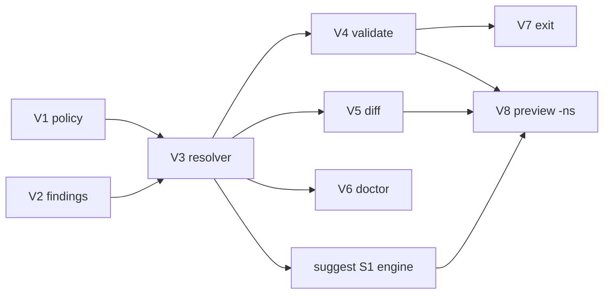

# Phase — Severity (tier policy engine)

**Status:** Planned — after Phase **G** (per [`active-phase.md`](./active-phase.md) backlog).

**Companion:** [`../systems/tiers.md`](../systems/tiers.md) · [`suggest.md`](./suggest.md) (suggestion engine + full fixes) · [`commands.md`](./commands.md)

---

## Mission

Level up violation reporting from flat strings + exit `1` to **policy-aware severity** on every command that emits issues — with optional **suggestion previews** that call the shared suggest engine (no duplicated fix logic).

Today: every `validate` violation → `error`; severity is not driven by tier policy.

Target:

1. **Severity as a tier policy rule** — new composable field on `tiers.policies.*.rules` (alongside `rootFlat`).
2. **Shared findings** — one collector produces structured issues with stable codes, severity, and **domain**.
3. **All violation commands adopt severity** — `validate`, `diff`, `doctor`, and later others emit graded `issues[]`.
4. **Triggers, not fixers** — validate/diff surface violations + preview (top N fixes via engine) + tip; full fixes and filters live in [`suggest.md`](./suggest.md).

### Architecture

```txt
governance/findings.ts      →  what is wrong (severity, code, domain)
governance/suggestions.ts   →  how to fix (kind, label, snippet)   ← suggest phase

suggest     = engine owner + full report (-k, -d, snippets)
validate    = trigger (findings + preview + tip)
diff        = trigger (tier findings + preview + tip)
doctor      = trigger (warnings + tip; preview optional)
CLI         = orchestrator (flags, --json, exit codes)
```

No duplication: validate **calls** `collectFixSuggestions(findings, { limit: N, primaryOnly: true })` for preview — it does not reimplement subpath/tier-exact heuristics.

---

## Today (baseline)

| Surface | Violations | Severity today | Next-step hint |
|---------|------------|----------------|----------------|
| `validate` | `violations: string[]` | all → `error` | message text only |
| `diff` | `tierViolations: string[]` | none in `issues[]` | none |
| `doctor` | `warnings: string[]` | `warning` in `issues[]` | generic (`run validate`) |
| `suggest` | unclassified flat names only | `info` per name | see [`suggest.md`](./suggest.md) |

**Already shipped:**

- `Issue` + `IssueSeverity` (`error` \| `warning` \| `info`) — `types/json/envelope.ts`
- Tier policies + `rootFlat: 'allow' \| 'deny'` — `tierPolicy.ts`
- Built-in policy names: `public`, `maintainer`, `experimental`, `preview`, `deprecated`
- `validate` / `diff` detection loops; `doctor` warning pattern

**Gap:** severity is hardcoded per command; findings are opaque strings; no shared collector; no preview hook to suggest engine.

---

## Target model

### New policy rule: `severity`

Extend `TierPolicyRules` with an optional severity preset per policy (config overrides built-in defaults):

```ts
tiers: {
  policies: {
    partnerApi: {
      rules: {
        rootFlat: 'deny',
        severity: 'warning', // default severity when this policy triggers a finding
      },
    },
  },
}
```

Built-in defaults (when `severity` omitted on policy):

| Policy | Default `rootFlat` | Default finding `severity` |
|--------|-------------------|---------------------------|
| `public` | allow | — |
| `maintainer` | deny | `error` |
| `experimental` | deny | `error` |
| `preview` | allow | `info` |
| `deprecated` | allow | `warning` |

Finding kinds that are **not** policy-scoped (tsconfig drift, unknown policy ref, unclassified) keep fixed severities: `error`.

Policy names drive severity — not just tier bucket id. A custom bucket with `policy: 'deprecated'` gets warning semantics even if the bucket is named `legacy`.

### Structured findings

```ts
type FindingDomain = 'tier' | 'parity' | 'policy' | 'subpath';

type GovernanceFinding = {
  code: string;           // e.g. expgov.validate.root_flat_denied
  severity: IssueSeverity;
  domain: FindingDomain;  // where the issue belongs (-d filter on suggest)
  message: string;
  symbol?: string;
  tier?: string;
  policy?: string;
};
```

Commands map findings → `issues[]`. Human output groups by severity (errors → warnings → info). JSON consumers filter on `issues[].severity`, `issues[].code`, and `data.findings[].domain`.

### Human output on triggers (default)

When ≥1 finding exists and **`-ns` is not set**:

```txt
       ✗ 9 internal-tier (maintainer) symbol(s) still flat on root

       Suggested fixes (preview):
       · move CLI_NAME → ./internal
       · move style → ./internal
       · … +7 more (use -F/--full or -T/--top <n>)

       · run expgov suggest for full list and snippets (-k subpath to filter)
```

With **`-ns, --no-suggestions`** (validate / diff / doctor only):

```txt
       ✗ 9 internal-tier (maintainer) symbol(s) still flat on root
       · run expgov suggest for fix suggestions
```

Preview is truncated (reuse `-T` / `-F` listing contract). Label `Suggested fixes (preview):` is dim so full output is clearly on `suggest`.

**`-ns` does not apply to `expgov suggest`** — filtering there uses `-k` / `-d` (see [`suggest.md`](./suggest.md)).

### JSON on triggers

```json
{
  "issues": [
    {
      "severity": "error",
      "code": "expgov.validate.root_flat_denied",
      "message": "runFoo (internal) exported flat on root"
    }
  ],
  "data": {
    "hints": ["run expgov suggest for full fixes (-k subpath to filter)"],
    "suggestionPreview": [
      {
        "findingCode": "expgov.validate.root_flat_denied",
        "kind": "subpath",
        "domain": "tier",
        "label": "move runFoo → ./internal"
      }
    ]
  }
}
```

- `--json` default: omit `suggestionPreview` (CI lean) unless `-v` or explicit opt-in documented in `docs/json.md`.
- `-ns` + `--json`: no `suggestionPreview`; hints may still include suggest pointer.

---

## Trigger flags (violation commands)

| Flag | Commands | Effect |
|------|----------|--------|
| `-ns, --no-suggestions` | `validate`, `diff`, `doctor` | Suppress `Suggested fixes (preview)` block |
| `-T, --top <n>` | same + listing | Caps preview rows (default 10, shared listing helper) |
| `-F, --full` | same | Show all preview rows |
| `--strict` | `validate`, `diff` | Exit `1` on warnings (see V7) |

Per-command only — not a global flag (`expgov -ns validate` is invalid).

---

## Slices (one PR each)

| # | Slice | Goal |
|---|-------|------|
| **V1** | Policy `severity` rule | `severity?: IssueSeverity` on `TierPolicyRules`; resolve in `tierPolicy.ts` |
| **V2** | Shared findings collector | `governance/findings.ts` — codes, severity, **domain** |
| **V3** | Severity resolver | Map finding + policy rules → `IssueSeverity`; tests per built-in policy |
| **V4** | `validate` integration | Graded `issues[]`; grouped human output; tip line |
| **V5** | `diff` integration | Tier violations → findings + `issues[]` + tip |
| **V6** | `doctor` + parity | Reuse codes; suggest tip when tier-related warnings likely |
| **V7** | Exit / CI contract | Errors → `1`; warnings/info → `0`; `--strict`; `docs/json.md` |
| **V8** | Preview + `-ns` | Wire `collectFixSuggestions` preview on triggers; `-ns, --no-suggestions` |

**Phase complete when:** V1–V8 shipped.

**V8 depends on:** [`suggest.md`](./suggest.md) **S1** (suggestion engine). V1–V7 can ship with tip-only; V8 lands with or immediately after suggest S1.

---

## V1 — Policy `severity` rule

**Types:** `packages/core/src/types/config/policies.ts`

```ts
export interface TierPolicyRules {
  rootFlat?: TierRootFlatRule;
  severity?: IssueSeverity;
}
```

**Defaults:** extend `BUILTIN_POLICY_DEFAULTS` in `tierPolicies.ts`:

```ts
public:       { rootFlat: 'allow', severity: undefined },
maintainer:   { rootFlat: 'deny',  severity: 'error' },
experimental: { rootFlat: 'deny',  severity: 'error' },
preview:      { rootFlat: 'allow', severity: 'info' },
deprecated:   { rootFlat: 'allow', severity: 'warning' },
```

**Exit:**

- [ ] Config override merges onto built-in defaults (same pattern as `rootFlat`).
- [ ] `systems/tiers.md` policy table updated.
- [ ] `expgov validate` after dogfood config change.

---

## V2 — Shared findings collector

**New module:** `packages/core/src/governance/findings.ts`

- Single pass over `InventorySnapshot` + project context.
- Parity checks → `domain: 'parity'`.
- Unknown policy refs → `domain: 'policy'`.
- Tier governance (unclassified, `rootFlat: 'deny'`) → `domain: 'tier'` (subpath-specific findings → `'subpath'` when applicable).
- Export tier-internal until classified in tiers config.

**Exit:**

- [ ] `collectGovernanceFindings(snapshot, opts)` — no CLI imports.
- [ ] Tests: fixture snapshots → codes + severities + domains.

---

## V3 — Severity resolver

`resolveFindingSeverity(finding, tierCatalog) → IssueSeverity`

1. Fixed-severity kinds (drift, unclassified, unknown policy) → `error`.
2. Policy-scoped kinds → `policy.rules.severity` or built-in default.
3. Fallback → `error`.

**Exit:**

- [ ] Unit tests for each built-in policy + custom override.

---

## V4 — `validate` integration

**Human:**

- Group: **Errors** (✗) → **Warnings** (!) → **Info** (·).
- Tip when findings exist: `run expgov suggest for fix suggestions` (preview added in V8).

**JSON:**

- `issues[]` with `severity`, `code`, `message`.
- `data.hints[]` includes suggest pointer.
- `data.violations` retained for compat or deprecated in same PR (note in `docs/json.md`).

**Exit:**

- [ ] Gate: `pnpm build`, `typecheck`, `test`, `expgov validate`.

---

## V5 — `diff` integration

- Right-snapshot tier violations → shared findings.
- Human tier-violations section uses severity styling where applicable.
- JSON `issues[]` aligned with validate shape.
- Suggest tip when tier violations present.

---

## V6 — `doctor` + command parity

- Parity drift warnings reuse finding codes from collector where overlap exists.
- Hint: `run expgov validate` for enforcement; `run expgov suggest` when tier issues likely.
- Preview on doctor optional / minimal (parity-only findings may have weak previews until engine grows).

Future commands that surface governance issues must use the same findings + severity — no one-off string arrays.

---

## V7 — Exit code & CI contract

| Mode | Errors | Warnings | Info | Exit |
|------|--------|----------|------|------|
| Default | any | any | any | `1` if ≥1 error |
| `--strict` | any | any | — | `1` if ≥1 error or warning |

- `ok` in JSON reflects errors only (warnings may yield `ok: true` with non-empty `issues`).
- CI gate remains `expgov validate` (often `validate --json` or `validate -ns` for quiet human runs).
- Document in `docs/json.md` (pre-v1 argv change in PR description).

---

## V8 — Suggestion preview + `-ns`

**Core:** validate/diff call:

```ts
const preview = collectFixSuggestions(findings, {
  limit: resolveListLimit(listView),
  primaryOnly: true, // one best fix per finding in preview
});
```

**CLI:** register on `validate`, `diff`, `doctor`:

```txt
-ns, --no-suggestions   suppress Suggested fixes (preview) block
```

**Reports:** `printValidateReport` / `printDiffReport` accept optional `suggestionPreview`; render block between violations and tip.

**Exit:**

- [ ] Default human fail shows preview when engine returns fixes.
- [ ] `validate -ns` shows violations + tip only.
- [ ] `--json` omits preview unless documented opt-in.
- [ ] Invalid state: preview never duplicates logic from `suggestions.ts`.

---

## Sequencing



**Schedule:** after Phase **G** per [`active-phase.md`](./active-phase.md) — then **Severity (V1–V7)** → **Suggest (S1–S8)** → **Severity V8** can ship in same PR as suggest S1 if convenient.

---

## Non-goals

| Item | Why |
|------|-----|
| Duplicate fix heuristics in validate/diff | Preview must call suggest engine only |
| `-k` / `-d` on validate/diff | Filter on `expgov suggest` only |
| `suggest --apply` / auto-fix | Deferred — mention in docs only when implemented |
| Auto-fix PR bot | Deferred — [`active-phase.md`](./active-phase.md) |
| Changing tier classifier priority | [`../systems/tiers.md`](../systems/tiers.md) unchanged |

---

## Files (expected touch)

| Area | Paths |
|------|-------|
| Policy types | `types/config/policies.ts`, `shared/constants/tierPolicies.ts`, `config/tierPolicy.ts` |
| Findings | `governance/findings.ts` (new) |
| Commands | `commands/validate.ts`, `format/diff.ts`, `commands/doctor.ts` |
| Reports | `logger/reports/validate.ts`, `logger/reports/diff.ts` |
| CLI | `packages/cli/bin/cli.ts` (`-ns` on trigger commands) |
| Docs | `systems/tiers.md`, `docs/json.md` |

---

## Receipt checklist (on ship)

- [ ] Row in [`../shipped/README.md`](../shipped/README.md).
- [ ] Durable notes in [`../systems/tiers.md`](../systems/tiers.md) + [`../systems/cli.md`](../systems/cli.md) (`-ns`, preview).
- [ ] Trim or delete per [`README.md`](./README.md) lifecycle.
