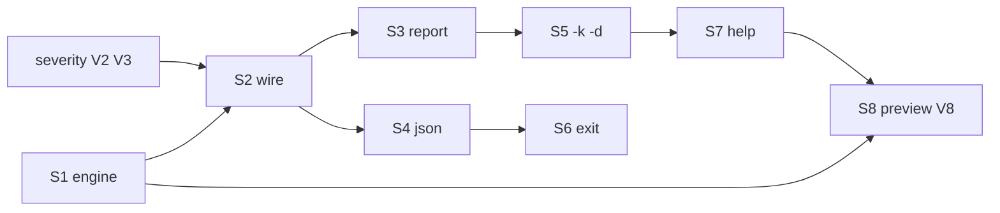

# Phase — Suggest (suggestion engine + full fixes)

**Status:** Planned — immediately after [`severity.md`](./severity.md) V1–V7 (shared findings + policy severity).

**Companion:** [`severity.md`](./severity.md) · [`fix.md`](./fix.md) (apply — deferred) · [`../systems/tiers.md`](../systems/tiers.md) · [`commands.md`](./commands.md)

---

## Mission

Build the **suggestion engine** — single implementation for how to fix every known governance issue — and expose it two ways:

1. **`expgov suggest`** — full fix-discovery command (all findings, snippets, `-k` / `-d` filters).
2. **Triggers** (`validate`, `diff`, …) — call the same engine with a **preview limit** (see severity **V8**).

```txt
collectGovernanceFindings()                    findings + severity + domain
collectFixSuggestions(findings, opts)          engine (this phase)

expgov suggest     →  engine(full)     + -k / -d / --severity
expgov validate    →  engine(preview)  + -ns to skip preview
```

No duplicated heuristics. `suggest` owns the engine; violation commands are orchestration + presentation.

---

## Today (baseline)

| Capability | Status |
|------------|--------|
| Unclassified flat exports | ✓ → `tiers.stable.exact` snippet |
| Policy-blocked root flats | ✗ not detected |
| Deprecated / preview on root | ✗ not detected |
| tsconfig ↔ npm drift | ✗ (validate/doctor only) |
| Subpath / promote / namespace hints | ✗ |
| `-k` / `-d` filters | ✗ |
| Preview on validate/diff | ✗ |

**Entrypoint:** `packages/core/src/commands/suggest.ts` · `collectTierExactSuggestions` · `printSuggestReport`

---

## Target

`suggest` runs `collectGovernanceFindings` ([`severity.md`](./severity.md)) plus **`collectFixSuggestions`** — maps each finding → one or more `FixSuggestion` records.

Eventually: **any known issue** the toolchain can detect should have ≥1 suggestable fix (or an explicit “manual review” note). New finding codes in severity → new row in coverage matrix + engine rule in the same PR.

### Fix suggestion shape

```ts
type FixKind =
  | 'tier-exact'        // add to tiers.<bucket>.exact
  | 'tier-tag'          // add @sdkTier on declaration
  | 'subpath'           // move export to published subpath (e.g. ./internal)
  | 'promote-tier'      // reclassify to stable / different bucket
  | 'demote-namespace'  // stop flat root export; use namespace re-export
  | 'config-snippet'    // paste-ready expgov.config.ts lines
  | 'tsconfig-sync';    // align paths ↔ exports

type FindingDomain = 'tier' | 'parity' | 'policy' | 'subpath';

type FixSuggestion = {
  kind: FixKind;
  domain: FindingDomain;  // mirrors finding.domain; used by -d filter
  label: string;
  snippet?: string;
  findingCode?: string;
};
```

### Engine API

```ts
type CollectFixSuggestionsOptions = {
  limit?: number;           // preview on triggers; undefined = no cap on suggest
  primaryOnly?: boolean;    // true for validate preview — best fix per finding
  kind?: FixKind[];       // -k filter
  domain?: FindingDomain[]; // -d filter
  severity?: IssueSeverity[]; // --severity filter (finding severity)
};

function collectFixSuggestions(
  findings: GovernanceFinding[],
  snapshot: InventorySnapshot,
  opts?: CollectFixSuggestionsOptions,
): FixSuggestion[];
```

Callable from **`suggest` command** and **validate/diff reports** (preview) — zero CLI imports inside `governance/suggestions.ts`.

### Coverage matrix (v1 → grow over time)

| Finding (severity collector) | `domain` | Suggest `kind`s |
|------------------------------|----------|-----------------|
| Unclassified flat | `tier` | `tier-exact`, `tier-tag` |
| `rootFlat: 'deny'` (internal/advanced) | `tier` | `subpath`, `demote-namespace`, `config-snippet` (override dim “not recommended”) |
| Deprecated on root | `tier` | `promote-tier`, `subpath` |
| Preview on root | `tier` | `subpath` (info) |
| tsconfig ↔ npm drift | `parity` | `tsconfig-sync` |
| Unknown policy ref | `policy` | `config-snippet` |

---

## CLI flags (`suggest` command)

| Flag | Short | Effect |
|------|-------|--------|
| `--kind <kinds>` | **`-k`** | Comma-separated `FixKind` filter — e.g. `-k subpath,tier-exact` |
| `--domain <domains>` | **`-d`** | Comma-separated area filter — `tier`, `parity`, `policy`, `subpath` |
| `--severity <levels>` | — | Comma-separated `error`, `warning`, `info` (finding severity) |
| `-v, --verbose` | — | Include info-level findings and secondary fix kinds |
| `-T, --top <n>` | — | Max suggestion rows (listing contract) |
| `-F, --full` | — | No truncation |

**Examples:**

```bash
expgov suggest                      # all actionable fixes
expgov suggest -k subpath           # only subpath moves
expgov suggest -d tier -k tier-exact  # tier issues, allowlist snippets only
expgov suggest -d parity            # tsconfig ↔ npm fixes only
```

Invalid `-k` / `-d` values → clear error listing allowed values (same pattern as invalid range help).

**Not on `suggest`:** `-ns` (lives on triggers only — [`severity.md`](./severity.md) V8).

---

## Slices (one PR each)

| # | Slice | Goal |
|---|-------|------|
| **S1** | Suggestion engine | `governance/suggestions.ts` — `collectFixSuggestions` + preview opts |
| **S2** | Wire shared findings | Replace `collectTierExactSuggestions`; use severity collector |
| **S3** | Human report 2.0 | Sections by domain; snippet blocks; bucket-aware formatters |
| **S4** | JSON payload | `data.suggestions[]` full shape; preview subset documented for triggers |
| **S5** | Filters `-k` / `-d` | CLI + core options; `--severity`; invalid value errors |
| **S6** | Exit contract | Exit `1` when actionable suggestions remain; `--strict` alignment |
| **S7** | Help + discoverability | help, `commandHelp.ts`, workflow examples |
| **S8** | Trigger preview handoff | Export stable preview contract; ship with severity **V8** |

**Phase complete when:** S1–S8 shipped; coverage matrix v1 rows all have ≥1 suggestion.

---

## S1 — Suggestion engine

**New module:** `packages/core/src/governance/suggestions.ts`

- Input: `GovernanceFinding[]`, `InventorySnapshot`, `CollectFixSuggestionsOptions`.
- Output: `FixSuggestion[]` (flat or grouped by finding).
- `primaryOnly: true` picks one ranked fix per finding for validate preview.
- Reuse / extend `formatStableExactSnippet` → `formatTierExactSnippet(bucket, names)`.

**Ranking (preview):** prefer `subpath` over `config-snippet` for `rootFlat: 'deny'`; prefer `tier-exact` over `tier-tag` for unclassified.

**Exit:**

- [ ] Callable from `suggest` and from validate/diff report layer (preview).
- [ ] Tests per coverage matrix row.
- [ ] No duplicate logic outside this module.

---

## S2 — Wire shared findings

- `runExportsSuggest` calls `collectGovernanceFindings` (severity phase).
- Drop duplicate unclassified-only loop in `suggest.ts`.
- Display order: errors → warnings → info; within domain groups.

**Depends on:** [`severity.md`](./severity.md) V2, V3.

---

## S3 — Human report 2.0

```txt
       ! Tier (3)
       · runInternalFoo — move to ./internal subpath
         …

       ! Unclassified (2)
       · MyNewExport — add to tiers.stable.exact or @sdkTier
         Paste into expgov.config.ts
         …

       · run expgov validate after updating tier rules
```

- `-T` / `-F` listing unchanged.
- Action-oriented — not a repeat of validate’s violation prose.

**Validate preview (severity V8)** uses same labels, fewer rows:

```txt
       Suggested fixes (preview):
       · move CLI_NAME → ./internal
       · move style → ./internal
```

---

## S4 — JSON payload

**Full `suggest`:**

```json
{
  "ok": false,
  "kind": "suggest",
  "issues": [ … ],
  "data": {
    "hasSuggestions": true,
    "suggestions": [
      {
        "findingCode": "expgov.validate.root_flat_denied",
        "kind": "subpath",
        "domain": "tier",
        "label": "move runFoo to ./internal subpath",
        "snippet": null
      }
    ],
    "counts": { "actionable": 3, "info": 1 }
  }
}
```

**Triggers:** `data.suggestionPreview` — same object shape, truncated; omitted under `--json` default / `-ns`.

Document in `docs/json.md`.

---

## S5 — Filters `-k` / `-d`

Wire in `packages/cli/bin/cli.ts` + `SuggestCliOptions`:

```txt
-k, --kind <kinds>       comma-separated fix kinds (subpath, tier-exact, …)
-d, --domain <domains>   comma-separated areas (tier, parity, policy, subpath)
     --severity <levels> comma-separated error, warning, info
```

Core applies filters inside `collectFixSuggestions` so preview and full suggest stay consistent.

**Exit:**

- [ ] `expgov suggest -k subpath` only shows subpath fixes.
- [ ] `expgov suggest -d tier -k tier-exact` narrows to allowlist snippets.
- [ ] Bad `-k foo` lists valid kinds.

---

## S6 — Exit contract

| Condition | Exit |
|-----------|------|
| No findings / no actionable suggestions after filters | `0` |
| Actionable suggestions remain | `1` |
| `--strict` | `1` if any warning-tier finding has open suggestions |

CI gate remains `expgov validate`; `suggest` is opt-in for authors fixing drift.

---

## S7 — Help + discoverability

- `expgov help suggest` — workflow: `validate` → `suggest` → edit config → `validate`.
- Examples: `expgov suggest -k subpath`, `expgov suggest -d parity`.
- Validate tip (severity): `run expgov suggest for full list and snippets (-k subpath to filter)`.

---

## S8 — Trigger preview handoff

Coordinate with [`severity.md`](./severity.md) **V8**:

- [ ] `collectFixSuggestions` preview path stable for validate/diff.
- [ ] Reports accept `suggestionPreview: FixSuggestion[]`.
- [ ] End-to-end: `validate` fail shows preview; `validate -ns` does not; `suggest -k` matches preview kinds.

Can land in same PR as S1 + severity V8.

---

## Deferred (apply path)

All writes live in [`fix.md`](./fix.md) — **`suggest` never gains `--apply`**.

| Item | Notes |
|------|-------|
| `expgov fix tags` | Safest automation — `@sdkTier` injection |
| `expgov fix config` | Merge tier-exact / policy snippets |
| `expgov fix subpath` | Postponed — needs dedicated engine; upstream must be stable |
| Auto-fix PR bot | After `fix` v1 — [`fix.md`](./fix.md) |

---

## Sequencing



**Schedule:** after [`severity.md`](./severity.md) V1–V7; **S1 + S8 + severity V8** should ship together for preview UX.

---

## Non-goals

| Item | Why |
|------|-----|
| Second copy of fix logic in validate | Engine only |
| `-ns` on suggest | Trigger flag only |
| `-k` / `-d` on validate/diff | User runs `suggest` to filter |
| Fixes for unknown finding codes | Add code + engine rule in same PR |
| Applying fixes / file writes | [`fix.md`](./fix.md) subcommands only |

---

## Files (expected touch)

| Area | Paths |
|------|-------|
| Engine | `governance/suggestions.ts` (new) |
| Command | `commands/suggest.ts` |
| Reports | `logger/reports/suggest.ts`, `validate.ts`, `diff.ts` (preview) |
| Types | `types/commands/cli.ts` (`SuggestCliOptions` + kind/domain) |
| CLI | `packages/cli/bin/cli.ts` (`-k`, `-d`, `--severity` on suggest) |
| Help | `help/index.ts`, `packages/cli/src/utils/help/commandHelp.ts` |
| Docs | `docs/json.md`, `systems/cli.md`, `examples/sdk/README.md` |

---

## Receipt checklist (on ship)

- [ ] Row in [`../shipped/README.md`](../shipped/README.md).
- [ ] Durable notes in [`../systems/cli.md`](../systems/cli.md) (engine, `-k`, `-d`, workflow).
- [ ] Trim or delete per [`README.md`](./README.md) lifecycle.
