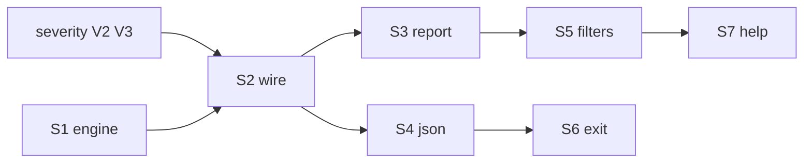

# Phase — Suggest (violations + fix suggestions)

**Status:** Planned — after [`severity.md`](./severity.md) V2/V3 (shared findings + policy severity).

**Companion:** [`severity.md`](./severity.md) · [`../systems/tiers.md`](../systems/tiers.md) · [`commands.md`](./commands.md)

---

## Mission

Make `expgov suggest` the **standalone fix-discovery command** — detect known governance issues and propose remediation for every issue type we can recognize.

Other commands (`validate`, `diff`, `doctor`, …) report issues with severity and **guide the user to run suggest**; they do **not** embed fix suggestions inline. That separation keeps gate commands fast and CI-friendly while `suggest` stays the rich, exploratory workflow.

```txt
User hits validate failure
       ↓
validate: ✗ errors + severity + "run expgov suggest"
       ↓
expgov suggest: full issue list + fix kinds + paste snippets
```

---

## Today (baseline)

| Capability | Status |
|------------|--------|
| Unclassified flat exports | ✓ → `tiers.stable.exact` snippet |
| Policy-blocked root flats | ✗ not detected |
| Deprecated / preview on root | ✗ not detected |
| tsconfig ↔ npm drift | ✗ (validate/doctor only) |
| Subpath / promote / namespace hints | ✗ |
| Filters (`--kind`, `--severity`) | ✗ |

**Entrypoint:** `packages/core/src/commands/suggest.ts` · `collectTierExactSuggestions` · `printSuggestReport`

---

## Target

`suggest` runs the **same** `collectGovernanceFindings` as validate (from [`severity.md`](./severity.md)) plus a dedicated **suggestion engine** that maps each finding → one or more `FixSuggestion` records.

Eventually: **any known issue** the toolchain can detect should have at least one suggestable fix path (or an explicit “manual review” note).

### Fix suggestion shape

```ts
type FixSuggestion = {
  kind:
    | 'tier-exact'        // add to tiers.<bucket>.exact
    | 'tier-tag'          // add @sdkTier on declaration
    | 'subpath'           // move export to published subpath (e.g. ./internal)
    | 'promote-tier'      // reclassify to stable / different bucket
    | 'demote-namespace'  // stop flat root export; use namespace re-export
    | 'config-snippet'    // paste-ready expgov.config.ts lines
    | 'tsconfig-sync';    // align paths ↔ exports
  label: string;
  snippet?: string;
  findingCode?: string;   // back-ref to expgov.*.code
};
```

### Coverage matrix (v1 → grow over time)

| Finding (from severity collector) | Suggest kinds |
|-----------------------------------|---------------|
| Unclassified flat | `tier-exact`, `tier-tag` |
| `rootFlat: 'deny'` (internal/advanced) | `subpath`, `demote-namespace`, `config-snippet` (policy override — dim “not recommended”) |
| Deprecated on root | `promote-tier`, `subpath` |
| Preview on root | `subpath` (info — consider before GA) |
| tsconfig ↔ npm drift | `tsconfig-sync` + pointer to validate parity rules |
| Unknown policy ref | `config-snippet` for `tiers.policies.<name>` |

New finding codes added in severity phase → add a row here before closing suggest phase slices.

---

## Slices (one PR each)

| # | Slice | Goal |
|---|-------|------|
| **S1** | Suggestion engine | `governance/suggestions.ts` — `collectFixSuggestions(findings, snapshot)` |
| **S2** | Wire shared findings | Replace `collectTierExactSuggestions` with findings collector + engine |
| **S3** | Human report 2.0 | Sections by issue category; multiple snippet blocks; bucket-aware `format*Snippet` |
| **S4** | JSON payload | `data.suggestions[]` with kinds, snippets, linked `findingCode`; `issues[]` severity from findings |
| **S5** | Filters | `--kind`, `--severity` (and/or `--code` prefix); `-v` shows info-level |
| **S6** | Exit contract | Exit `1` when actionable suggestions remain; align with severity `--strict` semantics |
| **S7** | Help + discoverability | Update help, `commandHelp.ts`, validate/diff hint text points here |

**Phase complete when:** S1–S7 shipped; coverage matrix v1 rows all have ≥1 suggestion.

---

## S1 — Suggestion engine

**New module:** `packages/core/src/governance/suggestions.ts`

- Input: `GovernanceFinding[]`, `InventorySnapshot`, tier catalog.
- Output: `FixSuggestion[]` (flat or grouped by finding).
- Zero CLI imports; unit-tested heuristics per finding code.
- Reuse / extend `formatStableExactSnippet` → `formatTierExactSnippet(bucket, names)`.

**Exit:**

- [ ] Engine callable only from `suggest` command (not validate/diff).
- [ ] Tests per row in coverage matrix.

---

## S2 — Wire shared findings

- `runExportsSuggest` calls `collectGovernanceFindings` (severity phase).
- Drop duplicate unclassified-only loop in `suggest.ts`.
- Respect policy severity for display ordering (errors first).

**Depends on:** [`severity.md`](./severity.md) V2, V3.

---

## S3 — Human report 2.0

**Sections (example):**

```txt
       ! Policy blocks (3)
       · runInternalFoo — move to ./internal subpath
         Paste into expgov.config.ts
         …

       ! Unclassified (2)
       · MyNewExport — add to tiers.stable.exact or @sdkTier
         …

       · run expgov validate after updating tier rules
```

- `-T` / `-F` listing policy unchanged.
- No duplication of validate’s full violation prose — suggest is **action-oriented**.

---

## S4 — JSON payload

```json
{
  "ok": false,
  "kind": "suggest",
  "issues": [ … ],
  "data": {
    "hasSuggestions": true,
    "suggestions": [
      {
        "findingCode": "expgov.validate.root_flat_denied",
        "kind": "subpath",
        "label": "move runFoo to ./internal subpath",
        "snippet": null
      }
    ],
    "counts": { "actionable": 3, "info": 1 }
  }
}
```

Document in `docs/json.md` alongside severity issue shape.

---

## S5 — Filters

| Flag | Effect |
|------|--------|
| `--severity error,warning` | Limit surfaced findings |
| `--kind tier-exact,subpath` | Limit suggestion kinds |
| `-v` | Include `info` / preview notes |

Default: show actionable (error + warning findings with suggestions).

---

## S6 — Exit contract

| Condition | Exit |
|-----------|------|
| No findings / no actionable suggestions | `0` |
| Actionable suggestions remain | `1` |
| `--strict` | `1` if any warning-tier finding has open suggestions |

CI should prefer `validate` for gates; `suggest` is opt-in for authors fixing tier drift.

---

## S7 — Help + discoverability

- `expgov help suggest` — workflow: validate → suggest → edit config → validate.
- Validate/diff/doctor hints (severity phase): exact string `run expgov suggest for fix suggestions`.
- `commandHelp.ts` examples: `expgov suggest`, `expgov suggest --kind subpath -v`.

---

## Sequencing



**Schedule:** immediately after [`severity.md`](./severity.md) V3 lands (can overlap S4–V7 with suggest S1).

**Unblocks:** auto-fix PR bot (deferred) — needs stable suggest JSON + kinds.

---

## Non-goals

| Item | Why |
|------|-----|
| Writing files / auto-fix | Dry-run only; copy/paste snippets |
| Embedding suggestions in validate/diff | [`severity.md`](./severity.md) — guide line only |
| Inventing fixes for unknown finding codes | Add code + suggestion rule together |

---

## Files (expected touch)

| Area | Paths |
|------|-------|
| Engine | `governance/suggestions.ts` (new) |
| Command | `commands/suggest.ts` |
| Reports | `logger/reports/suggest.ts` |
| Types | `types/commands/cli.ts`, `types/json/` (suggest data shape) |
| Help | `help/index.ts`, `packages/cli/src/utils/help/commandHelp.ts` |
| Docs | `docs/json.md`, `examples/sdk/README.md` |

---

## Receipt checklist (on ship)

- [ ] Row in [`../shipped/README.md`](../shipped/README.md).
- [ ] Durable notes in [`../systems/cli.md`](../systems/cli.md) (suggest workflow).
- [ ] Trim or delete per [`README.md`](./README.md) lifecycle.
